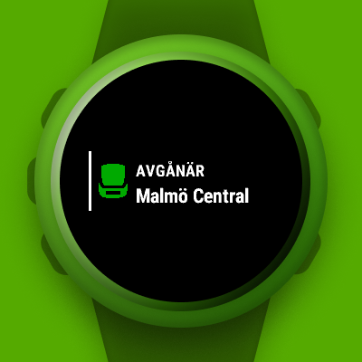
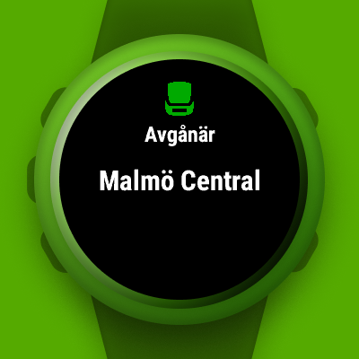
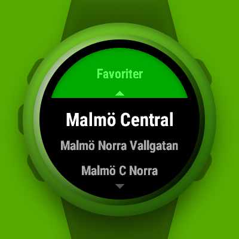
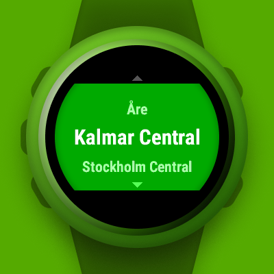
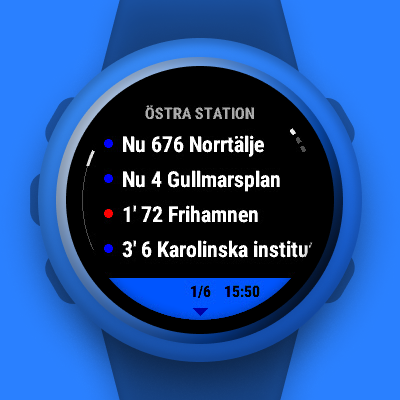
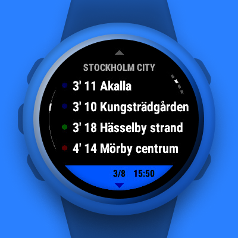

# Avgånär: Stockholm departures

A Garmin Connect IQ widget displaying SL nearby stops and departures, using Trafiklab's APIs.

## Preview

      

## Features

- View nearby stops
- Save favorite stops and view anywhere
- View departures
  - Color coded and sectioned by mode
  - See if a departure has any deviations
- Settings for tuning max stops and departures time window

## Dependencies

- [Carbon Barrel](https://github.com/felwal/carbon-barrel)
