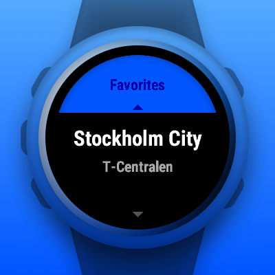
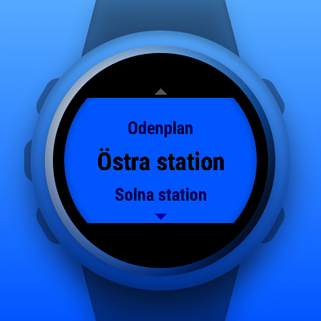
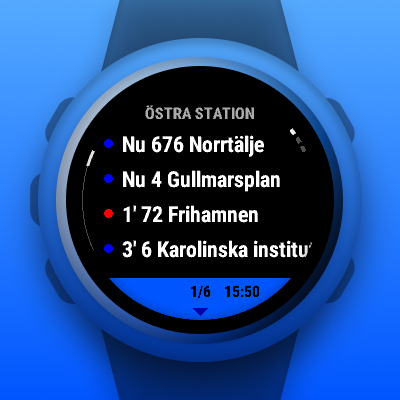
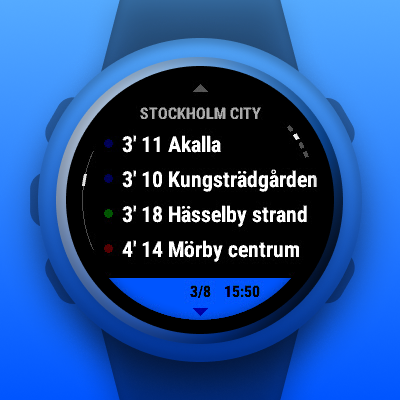

# Avganar

A Garmin Connect IQ widget displaying SL departures, using Trafiklab's APIs.

## Preview

      

## Features

- View nearby stops
- Save favorite stops and view anywhere
- View departures
  - Color coded and sectioned by mode
  - See if a departure has any deviations
- Settings for tuning max stops and departures time window
