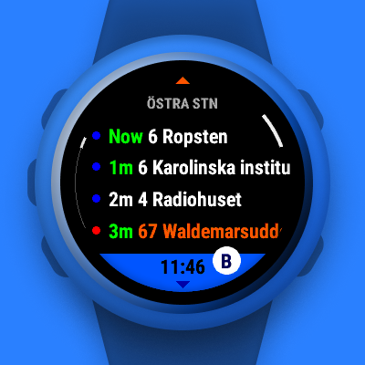

# Avgånär: Stockholm departures

A Garmin Connect IQ widget displaying (public transport) nearby stops and departures within Stockholms Lokaltrafik (SL). Uses Trafiklab's APIs.

Get it on the [Connect IQ Store](https://apps.garmin.com/en-GB/apps/a96ddb52-3edd-4298-8348-5bd818376a2a).

## Preview

<p>      </p>

## Features

- View nearby stops
- Save favorite stops and view anywhere
- View departures
  - Color coded and sectioned by mode
  - See deviations and their importance level
- Limit memory consumption by tuning settings

## Roadmap

- [ ] extend to the whole of Sweden

## APIs

- [SL Nearby stops 2](https://www.trafiklab.se/api/trafiklab-apis/sl/nearby-stops-2/)
- [SL Departures 4](https://www.trafiklab.se/api/trafiklab-apis/sl/departures-4/)

## Develop

Place your API keys in `ServiceSecrets.mc`:

```
const API_KEY_STOPS = "<KEY>";
const API_KEY_DEPARTURES = "<KEY>";
```

## Build

I develop on `main` and build on `release` using [Prettier Monkey C](https://github.com/markw65/prettier-extension-monkeyc).

## Fork

You are more than welcome to make a fork and adapt the project to your own country's public transport.

## Credits

Some icons have been adapted from [Google Fonts](https://fonts.google.com/icons?icon.query=sign).
