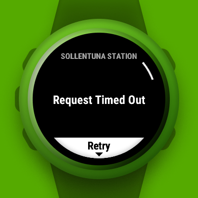

<p align="center"></p>
<h1 align="center">Avgånär: Stockholm departures</h1>

Avgånär is a Garmin watch widget displaying (public transport) nearby stops and departures within Stockholm (SL) in 
Sweden.

Get it on the [Connect IQ Store](https://apps.garmin.com/apps/a96ddb52-3edd-4298-8348-5bd818376a2a).

## Features

- View nearby stops
- Save favorite stops and view anywhere
- View departures
  - Sectioned and color coded by transport mode and group
  - See deviations and their importance level
- Limit memory consumption by tuning settings

## Preview

<p>
  
  
  
  
  
  
  
  
  
</p>

## APIs

Avgånär uses APIs provided by [Trafiklab](https://www.trafiklab.se):

- [ResRobot 2.1 Nearby Stops](https://www.trafiklab.se/api/our-apis/resrobot-v21/nearby-stops/)
- [SL Transport 1](https://www.trafiklab.se/api/trafiklab-apis/sl/transport)
- [GTFS Sverige 2](https://www.trafiklab.se/api/gtfs-datasets/gtfs-sverige-2)
- ~~[SL Nearby Stops 2](https://github.com/trafiklab/trafiklab.se/blob/development/content/api/our-apis/sl/nearby-stops-2.md)~~
- ~~SL Departures 4~~

## Develop

Place your API keys somewhere gitignored, such as `ServiceSecrets.mc`:

```
const API_KEY_STOPS = "<KEY>";
const API_KEY_DEPARTURES = "<KEY>";
```

## Build

I develop on `develop` and build on `main` using [Prettier Monkey C](https://github.com/markw65/prettier-extension-monkeyc).

## Fork

You are more than welcome to make a fork and adapt the project to your own country's public transport.
